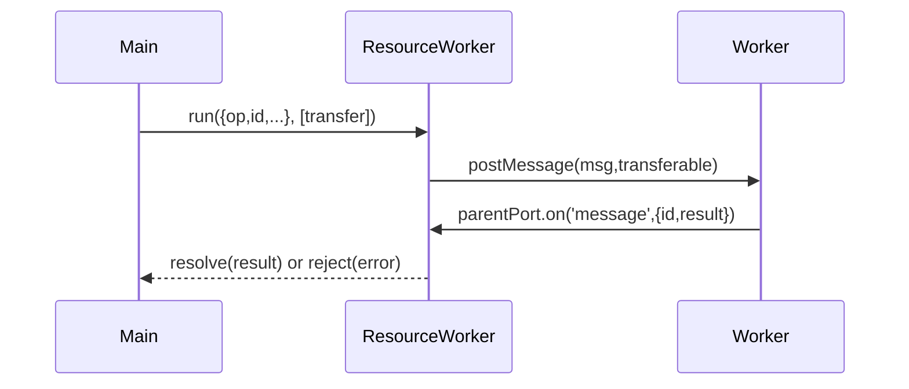

# Preview3 Shim

WASI Preview2 implementations for Node.js.

# License

This project is licensed under the Apache 2.0 license with the LLVM exception.
See [LICENSE](LICENSE) for more details.

### Architecture

The `preview3-shim` package leverages the ResourceWorker abstraction to run blocking or long‐running
WASI operations off the main thread. Each ResourceWorker instance wraps a Node.js Worker pointing at
a specific worker script. Tasks are sent via postMessage with unique `id` and optional transferable
streams or ports. The worker processes the operation and posts back `{id, result}` (or `{id, error}`),
which ResourceWorker dispatches to the correct promise resolver. This isolates I/O and computation
per resource type and prevents blocking of the event loop.

### Contribution

Unless you explicitly state otherwise, any contribution intentionally submitted
for inclusion in this project by you, as defined in the Apache-2.0 license,
shall be licensed as above, without any additional terms or conditions.
